<div align="center">

# The architecture of wostuast

**One Python file, one log, one page — and how they find out who needs you.**

*A guided tour for people who want to change the code, or who just like to know how things work.*

</div>

---

> [!NOTE]
> This document explains *how* wostuast works and *why* it is built this way.
> To *use* wostuast, read the [README](README.md).
> To *change* wostuast, read this first, then [`CLAUDE.md`](CLAUDE.md) and the rules in [`.claude/topics/`](.claude/topics/).
> Where this document and the code disagree, the code is right. Please fix this document in the same pull request.

## Contents

- [Prologue: five agents and one human](#prologue-five-agents-and-one-human)
- [Chapter 1. What we build, and what we do not](#chapter-1-what-we-build-and-what-we-do-not)
- [Chapter 2. The big picture](#chapter-2-the-big-picture)
- [Chapter 3. Recording: the hook that must never fail](#chapter-3-recording-the-hook-that-must-never-fail)
- [Chapter 4. The daemon: from a log to a list of sessions](#chapter-4-the-daemon-from-a-log-to-a-list-of-sessions)
- [Chapter 5. Transcripts: what the agent said](#chapter-5-transcripts-what-the-agent-said)
- [Chapter 6. Git: what the agent changed](#chapter-6-git-what-the-agent-changed)
- [Chapter 7. The wire: HTTP, a token, and one stream](#chapter-7-the-wire-http-a-token-and-one-stream)
- [Chapter 8. The page: a front end without a build step](#chapter-8-the-page-a-front-end-without-a-build-step)
- [Chapter 9. Back to the terminal: four verbs and no more](#chapter-9-back-to-the-terminal-four-verbs-and-no-more)
- [Chapter 10. Safety in layers](#chapter-10-safety-in-layers)
- [Chapter 11. Install, update, uninstall](#chapter-11-install-update-uninstall)
- [Chapter 12. The speed budget](#chapter-12-the-speed-budget)
- [Chapter 13. How we test it](#chapter-13-how-we-test-it)
- [Chapter 14. Roads not taken](#chapter-14-roads-not-taken)
- [Epilogue: where to go next](#epilogue-where-to-go-next)
- [Glossary](#glossary)

---

## Prologue: five agents and one human

It is a normal afternoon. You have five Claude Code agents. Each one works in
its own tmux window and its own git worktree. One agent writes a parser. One
fixes a test. One refactors a module. Two others do things you no longer
remember.

Then the question comes: **who needs me?**

To answer it, you go from window to window. Agent three waits for permission to
run `make`. It has waited for twenty minutes. Agent five asked you a question
an hour ago. Agent one finished long ago and has nothing to do.

A terminal is a good place to type. It is a bad place to *read*, and a very bad
place to *watch five things at once*. wostuast is the reading side. It is one
page in your browser. The page tells you:

- which agent needs you, and why;
- what each agent said, as real Markdown;
- what each agent changed, as a diff you can review.

*"Wos tuast?"* is Austrian for *"what are you doing?"*. That is the one
question this program asks, again and again, of every agent you run.

The rest of this document explains how a small program answers that question
well. The design has a few strong ideas. Most of the code exists to keep those
ideas true under real conditions: crashes, slow networks, huge files, and
agents that do two things at once.

---

## Chapter 1. What we build, and what we do not

Good architecture starts with a short list of goals and a firm list of
non-goals. In wostuast, these lists decide every feature. When a request fights
a goal, we ask whether the goal must change. We ask that *before* we write code.

### The goals

| # | Goal | What it means in practice |
| --- | --- | --- |
| 1 | Answer "who needs me?" in one glance | Amber rows at the top of the sidebar, a browser alert, a coloured tab icon. |
| 2 | Show what an agent writes as real Markdown | The transcript, plan files and specs are drawn, not dumped as text. |
| 3 | Show a worktree's changes without an editor | A Files tab and a Review tab with a real diff. |
| 4 | Stay small | One Python file. The standard library only. No daemon needed to *record*. No config file needed to run. One-line install and uninstall. |
| 5 | Look good enough to sell itself in a screenshot | A careful palette, light and dark, every colour a named variable. |

### The non-goals

These are just as important. If a feature needs one of these, we leave the
feature out.

| Non-goal | Why |
| --- | --- |
| **Own the agent process** | tmux owns the terminal. wostuast never starts, wraps or kills an agent. Typing into a pane is allowed; a signal is not. |
| **Be a terminal emulator** | The tmux window is always one keystroke away. A "Peek" tab once showed a copy of the pane. It was removed. |
| **Approve a permission prompt from the browser** | An approval you cannot see is how directories get deleted. Saying **No** is allowed: a wrong No is easy to undo, a wrong Yes is not. |
| **Orchestrate agents** | No agent-to-agent messages, no teams, no spend limits. wostuast watches; it does not steer. |
| **Know your worktree layout** | A session is an agent standing in a directory. Nothing more. |
| **Need a build step or a dependency** | No Electron, no React, no npm, no pip. |
| **Send a review anywhere but the agent** | No GitHub API. A review goes into the agent's own terminal, and you read every byte first. |

> [!TIP]
> When you propose a feature, check it against both tables first. Most
> "simple" features fail the non-goals. That is a feature of the design, not a
> bug.

---

## Chapter 2. The big picture

wostuast has three moving parts. Each one has a single job.

1. **The recorder.** Claude Code runs a small program, the *hook*, on every
   event. The hook appends one JSON line to a log file and exits.
2. **The daemon.** The `wostuast` command reads that log, builds a model of
   every session, and serves one web page on `127.0.0.1`.
3. **The page.** It shows the sessions, the transcripts and the diffs. It
   updates itself through a live stream. When you act, it asks the daemon to
   type into a tmux pane.

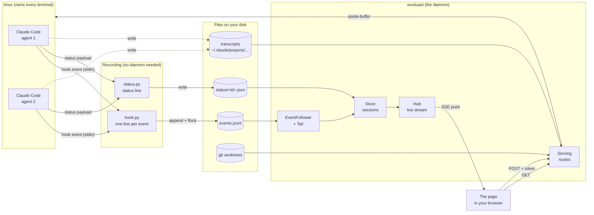

Notice three things in this picture.

- **The arrows into the log go one way.** The hook never talks to the daemon.
  If the daemon is down, the log still grows. When the daemon starts, it reads
  everything it missed.
- **The page only reads, except for one narrow door.** Four verbs go back to
  the terminal: jump, send, answer and no. They all pass through tmux.
- **There is no database.** The state of every session is rebuilt from a log
  of plain text. You can read that log with `less`.

### A tour in one file

The whole program is one file, `wostuast`. It starts with Python and ends with
a long string, `PAGE`, that holds the HTML, the CSS and the JavaScript of the
page. The file has sections. Each one starts with a marker line, so one command
prints the map:

```sh
grep -n "^# --- \|^// --- " wostuast
```

| Part | The main sections, in order |
| --- | --- |
| Python | constants · log · event log · following files · session model · transcript · git facts · files and diffs · status · settings.json · output helpers · tmux verbs · slash commands · the daemon · commands · command line · the page |
| JavaScript (inside `PAGE`) | asking the daemon · the live slot · dragging an edge · the two fetched scripts · settings · colours · the sidebar · the tab icon · alerts · ticket links · the transcript · painting code · the Files tab · the tree · long files · the Diff tab · the review · the tabs · talking to the daemon · keys · slash completion |

> [!NOTE]
> Why one file? The install command downloads one file from one URL. Two files
> would need a build step to join them, and a build step is a non-goal. The
> file is long, but its sections make it easy to move around in.

---

## Chapter 3. Recording: the hook that must never fail

### What Claude Code gives us

Claude Code can run a command when something happens in a session. This is a
*hook*. Claude Code sends the event to the command as JSON on stdin. wostuast
registers its hook for twelve events (`HOOK_EVENTS`):

| Event | What it tells us |
| --- | --- |
| `SessionStart` | A session began (or resumed, or came back after `/clear` or a compaction). |
| `UserPromptSubmit` | You sent a prompt. The agent is now working. |
| `PreToolUse` | The agent starts a tool call. |
| `PostToolUse` | A tool call finished. |
| `PostToolUseFailure` | A tool call failed. |
| `PermissionRequest` | A permission dialog appeared. **The agent needs you.** |
| `Notification` | Claude Code wants your attention (late, but useful). |
| `Stop` | The agent finished its turn. |
| `StopFailure` | The turn ended with an API error. **The agent needs you.** |
| `SubagentStop` | A subagent finished. |
| `PreCompact` | The context is about to be compacted. |
| `SessionEnd` | The session ended. |

### The two rules of the hook

The hook runs inside Claude Code's own loop, many times a minute. So it lives by
two hard rules.

> [!CAUTION]
> **Rule 1: the hook never prints.** Claude Code reads the hook's stdout as an
> *answer*. For `PermissionRequest` and `PreToolUse`, some answers mean
> "allow". One stray `print` could approve a command that nobody saw. So
> `cmd_hook` writes nothing to stdout, ever. Errors go to a private text log,
> `wostuast.log`.

> [!CAUTION]
> **Rule 2: the hook never blocks.** If the hook hangs, the agent hangs.
> `cmd_hook` sets an alarm (`give_up_after`, a few seconds) before it does
> anything. If the disk is slow or a lock is stuck, the alarm ends the hook,
> and the agent goes on. A missing line in the log is bad. A frozen agent is
> worse.

### One line, appended under a lock

What the hook does is short:

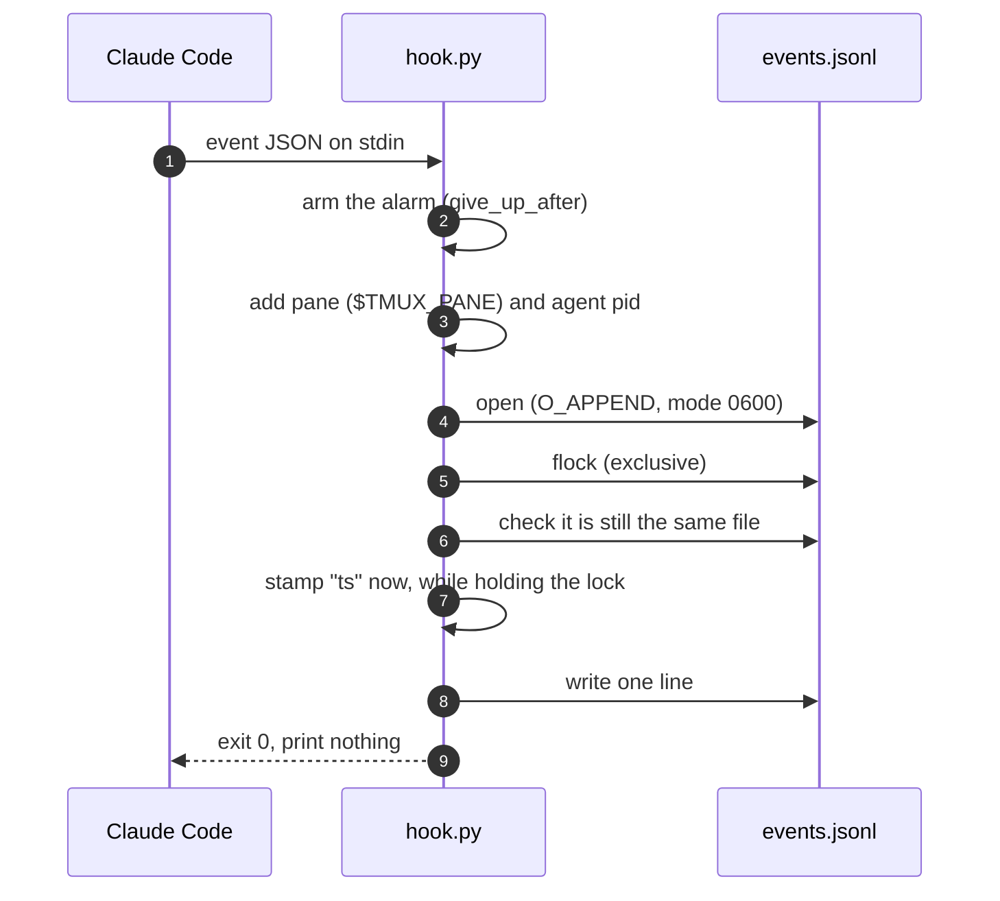

A few details in this picture carry real weight.

- **The pane.** tmux tells every program in a pane its id, in `$TMUX_PANE`.
  The hook adds it to the event. Later, the daemon uses it to type into the
  right pane. An agent that reads no terminal gets no pane
  (`reads_terminal`): a Remote Control session and a `claude -p` read a
  pipe, and the pane they inherited belongs to something else.
- **The agent's pid.** The hook's parent is a short-lived shell, not Claude
  Code. So `agent_pid` walks up the process tree in `/proc` until it finds
  Claude Code. The daemon uses the pid to learn when an agent dies without a
  goodbye.
- **The time stamp is taken *inside* the lock** (`append_event`, `stamp=True`).
  Before this fix, four hooks that ran at the same moment put about one line in
  120 out of order. Now the order of lines in the file is the order of time.
- **The file can change under us.** When the log grows past its limit
  (`EVENTS_MAX_BYTES`), a hook renames it to `events.N.jsonl` and starts a
  fresh one. Another hook may hold the old file open. So, after the lock, the
  hook checks the file's device and inode (`still_the_file`) and tries again
  if they changed. Archives are never deleted: the log is your history.

> [!IMPORTANT]
> **The raw payload is kept whole.** The hook never strips fields from an
> event. A newer Claude Code may send a field we do not know yet. An older
> wostuast must not break on it, and a newer wostuast may want it later.

### Why a file, and not a request to the daemon?

It is tempting to make the hook send an HTTP request to the daemon. We did not,
for three reasons:

1. **History survives.** If the daemon is down, a request is lost. A line in a
   file is not.
2. **Speed.** An append under `flock` takes about 0.1 ms. A row in SQLite took
   about 2 ms, and 183 ms in the worst case with 32 writers.
3. **Nothing to configure.** A file path needs no port, no token and no retry
   logic.

### A hook made from the program itself

For a long time, the hook was simply `wostuast hook` (the verb is gone now).
Python then had to read and compile the whole file — the page included — on
every event. On a test machine that cost about 131 ms for each event.

Now `install` writes a small file, `~/.local/share/wostuast/hook.py`. It is
*generated* from `wostuast` itself:

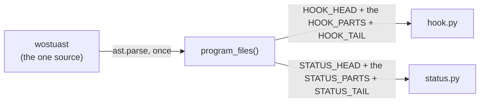

`program_files` parses the program once. It takes the functions and constants
named in `HOOK_PARTS`, copies their source text, and wraps them in a small head
(the imports) and tail (the call). If a part is missing, it raises an error, so
`install` stops instead of writing a hook that fails in silence.

The hook file is not a second source of truth. Nobody edits it. `install`
writes it again whenever it differs from what this version would build, and
`doctor` reports when it is out of date.

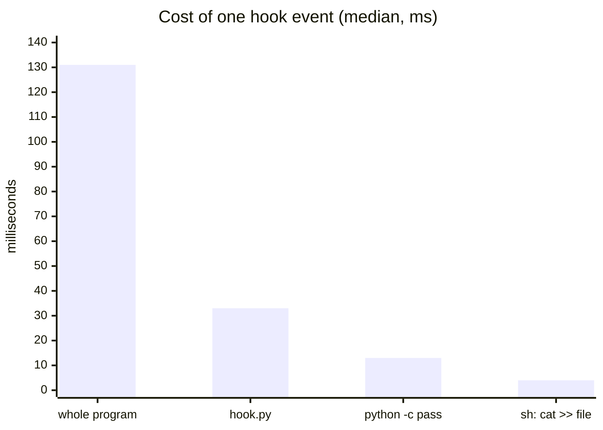

The floor is the Python interpreter itself: about 13 ms to do nothing. The
hook file is about 20 ms above that floor, and most of those go to the imports
it really needs.

### The status line: a second small program

Claude Code also has a *status line*: a command that prints one line under the
prompt. Its payload has two facts that no hook has: **how full the context
is** and **how much the session cost**. wostuast wants both for the sidebar.

So `install` registers `~/.local/share/wostuast/status.py` as the status line.
It is generated the same way as the hook, from `STATUS_PARTS`. It does two
things:

1. It keeps a few fields (name, model, context percent, cost, agent) in a small
   file per session, `status/<id>.json`. It writes the latest value only, never
   the log.
2. It prints a short line for your terminal. If you already had your own status
   line, wostuast leaves it alone and tells you how to chain it with
   `--then`: `status.py --then '<your command>'`. Then your line is still the
   line you see.

> [!NOTE]
> Why not put the status code in `hook.py`? The status code needs the
> `dataclasses` module, which costs about 8 ms to import. Every hook event would
> pay that. A second file costs the hook nothing.

---

## Chapter 4. The daemon: from a log to a list of sessions

Run `wostuast` with no arguments, and the daemon starts. `cmd_serve` does its
work in this order:

1. It prints the tools it found (Python, tmux, git).
2. It makes sure the state directory exists and is private (mode `0700`).
3. It takes the daemon's lock, `daemon.lock` in the state directory
   (`one_daemon`). If another daemon holds it, the start stops here, before it
   writes anything, and says where the other one serves its page.
4. It brings the install up to date (`bring_up_to_date`): the program, the hook
   file, the status file, and the entries in Claude Code's `settings.json`. It
   rewrites only what is out of date.
5. It binds to `127.0.0.1` on port 7331 (or `--port`; `0` lets the system
   pick), and writes the page's address into the lock file.
6. It starts one worker thread that reads the log, and serves HTTP on the main
   thread.

> [!NOTE]
> **Why a lock, and not just the port?** With `--port`, a second daemon could
> run beside the first. Both would then write a `Declined` event for the same
> dialog, and "one send at a time" would hold in each daemon, but not across
> the two. The lock is an `flock`, so the kernel lets go of it when the process
> ends, even after a crash or a `kill -9`. No stale lock is ever left behind.

### The threads

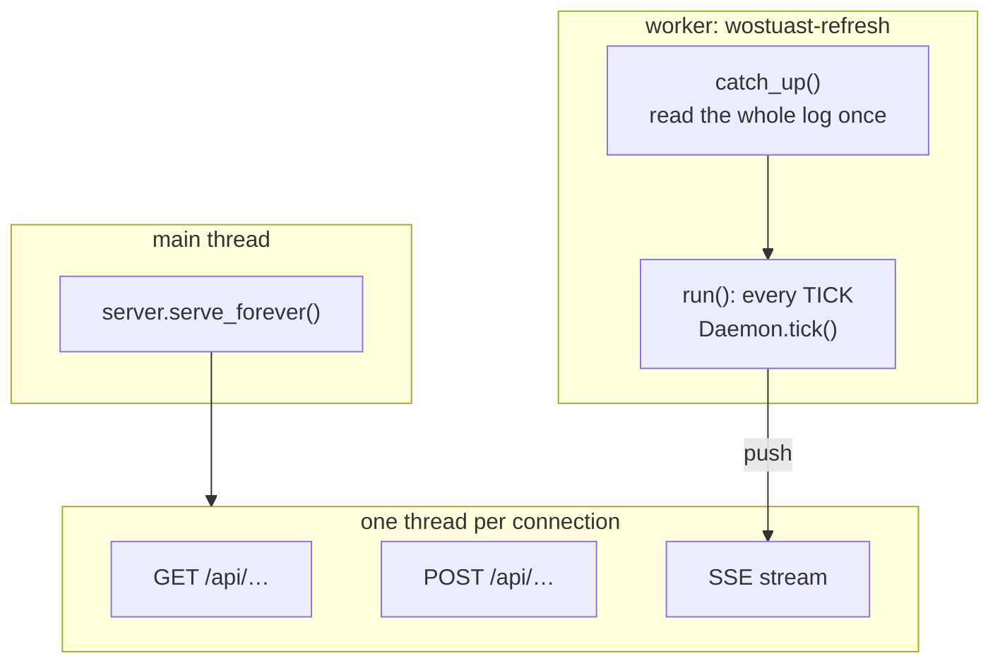

**One thread writes the model. Every other thread only reads it.** The worker
thread is the only one that changes the `Store`. Readers take `Store.rows`,
which the worker replaces whole and never edits in place. So readers need no
lock.

There are two small exceptions, and each one has a lock:

- **Names and snoozes.** `POST name` runs in a request thread. Two renames
  at once once built two new name maps from the same old one, and one name
  was lost. Now writers of `Store.names` take the `naming` lock. `POST
  snooze` writes `Store.snoozes` under the same lock, for the same reason.
- **Transcript readers** are shared between the worker and the request
  threads, under `Daemon.lock`.

### The tick

The worker wakes up about once a second (`TICK`) and runs `Daemon.tick`:

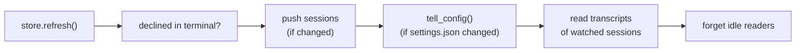

`store.refresh` is the heart of it:

1. **Follow** the log and fold every new event into the sessions.
2. **Settle**: every few seconds, check that each agent's pid is still alive,
   and read the status files and the names.
3. **Reload git** for the sessions on screen, but each directory at most once
   in a while (`GIT_MIN_INTERVAL`).
4. **Rebuild `rows`**, and say whether anything changed. Only a change is
   pushed to the page.

### Reading a file that someone else is writing

The log is written by many hooks while the daemon reads it. `Tail` handles the
hard cases:

- **A half-written last line.** A hook may be in the middle of its write. `Tail`
  keeps the part after the last newline in `partial` and waits for the rest.
- **A file that was replaced.** If the inode changes, or the file is shorter
  than the place we read up to, `Tail` starts again from the beginning.
- **A file that grows while we read.** `Tail` reads only up to the size the
  file had when the read began, in chunks of 1 MiB. Before that limit, a
  400 MB log once held 821 MB of memory.

`EventFollower` sits on top. It reads every archive, oldest first, then the
live log. It opens the live file *before* it lists the archives. So a log that
becomes an archive between the two steps is handed over with its read position,
and no line is read twice or lost.

> [!TIP]
> **Every line is folded once, in order, and none is thrown away.** `Store.fold`
> puts each event in its own `try`. A strange event costs only itself. The rest
> of the log still counts.

### The session state machine

Each session is a `Session` object. Its most important field is `state`. Hook
events move it between five states:

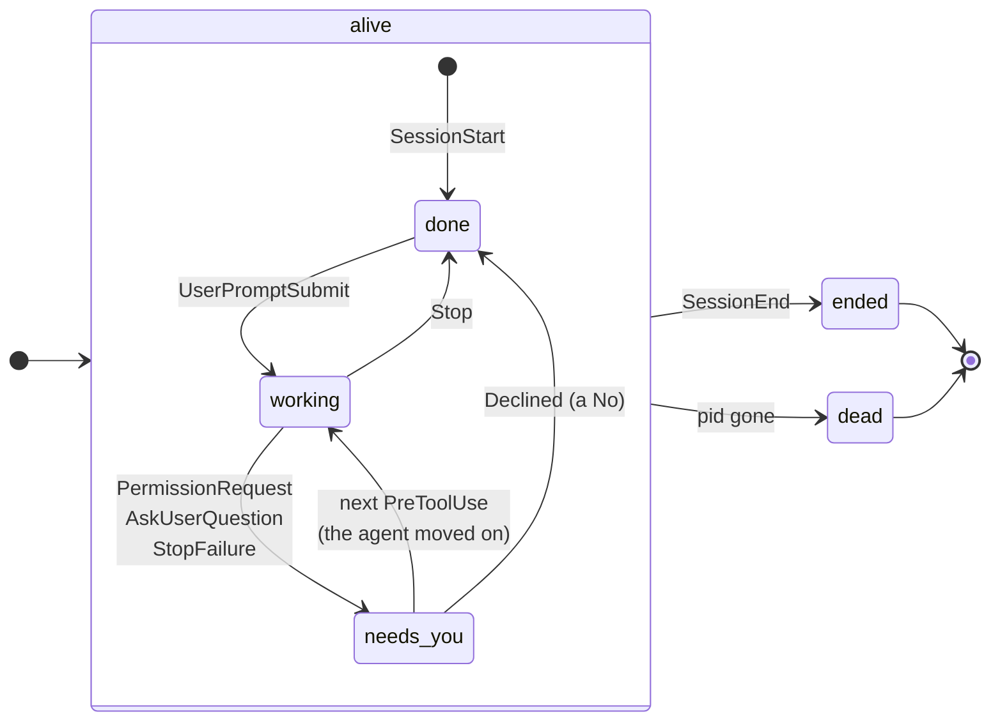

The page shows the states with words and colours (`STATE_WORDS`):

| State | Word on the page | Colour | Group in the sidebar |
| --- | --- | --- | --- |
| `needs_you` | needs you | amber | **needs you** (top) |
| `working` | working | green | working |
| `done` | ready | blue | ready |
| `ended` | ended | grey | history |
| `dead` | killed | grey | history |

**"Needs you" means the agent is blocked on you.** Four things cause it:

- a permission dialog (`PermissionRequest`);
- a question from the `AskUserQuestion` tool, which arrives the same way;
- a permission `Notification`;
- a turn that ended with an API error (`StopFailure`).

> [!NOTE]
> **Why listen to `PermissionRequest` *and* `Notification`?**
> `Notification` also says "the agent needs you". But Claude Code sends it only
> after you have been idle for six seconds, and it checks on a six-second
> timer. So it can arrive twelve seconds late. `PermissionRequest` fires the
> moment the dialog appears. For a tool whose first job is "who needs me?",
> twelve seconds is too slow.

### War story: the green row that was wrong

How does a session leave "needs you"? There is no hook for "you clicked Yes".
There is no hook for "you clicked No" either. The only sign is that the agent
moves on.

The first version cleared the amber on *any* tool event. Then a real machine
showed something surprising. In 233 tool calls, Claude Code sometimes ran two
tools at once. Both `PreToolUse` events came first, then the dialog for one of
them. When the *other* call finished, its `PostToolUse` cleared the amber. The
row turned green while the agent still sat blocked on its dialog.

That is the one thing this program exists to say — said backwards.

The fix is in `_on_pre_tool`. **A call that starts** means the agent moved on,
so the question was answered. **A call that finishes** says only that this
call finished. It clears the amber only if it is the call the dialog was about.

### Following a `/clear`

When you type `/clear`, Claude Code ends the session and starts a new one with
a new id. To you, it is the same agent in the same pane. `link_clear` joins the
two halves: a `SessionEnd` with reason `clear`, and a `SessionStart` with
source `clear`, from the same process, a moment apart. The name you gave the
session moves to the new id, and the page follows you there.

### Forgetting

A model that only grows will one day fill the memory. So the daemon forgets on
purpose:

- `mark_dead` buries a session whose process is gone.
- `forget_quiet` drops sessions that were quiet for a week (`SESSION_MAX_AGE`).
- `forget_gone` closes transcript readers that nobody watched for a minute
  (`READER_IDLE`), unless a dialog is open.

With these, a year of real logs (200 MB) went from 641 MB of memory to 28 MB,
and stayed flat.

---

## Chapter 5. Transcripts: what the agent said

Claude Code writes every session to a JSONL file of its own, under
`~/.claude/projects/`. The hook events give us its path. A `Transcript` object
reads that file with a `Tail`, and turns its records into **blocks**: a prompt,
a reply, a thought, a tool call with its result.

- `Transcript.add` folds one record. A tool result finds its call by
  `tool_use_id`. A compaction becomes a divider. A queued message becomes a
  block of its own.
- Every transcript has a `run` and a `version`. When the file is replaced,
  `run` goes up and the blocks start over. When blocks change, `version` goes
  up.
- The daemon reads transcripts only for sessions that a page *watches*. It
  pushes only the blocks that changed.

> [!IMPORTANT]
> **A path from the log is input, not a promise.** Before the daemon reads a
> transcript, `safe_transcript` checks that the path is inside Claude Code's
> config directory and ends in `.jsonl`. A crafted event cannot make the daemon
> read your SSH keys.

---

## Chapter 6. Git: what the agent changed

Every session stands in a directory. If that directory is a git worktree, the
daemon asks git three kinds of questions.

| Question | Function | Used by |
| --- | --- | --- |
| Which branch? Ahead or behind? How many changes? | `git_facts_many` | the sidebar row |
| Which files are here? | `worktree_files` | the Files tab |
| What changed, since where? | `worktree_diff`, `pick_base` | the Review tab |

All git calls go through `run`. It has a short timeout and returns `None` on
any failure. **An error from git never crashes anything**, and a failed call
is shown as a failure, never as an empty answer. ("No changes" and "git did
not answer" are different things. The page must not confuse them.)

### Picking the base

A diff needs a base: changes *since where*? You do not want to configure that.
So `pick_base` works it out. It ranks the branches by how far HEAD is ahead of
and behind each one, and picks the branch the work was most likely cut from.
On a big repository (150,000 commits, 3,000 branches) that takes more than a
second, so the ranking is cached in `Daemon.ranks`.

### Caching what does not change

The Review tab asks for the diff every few seconds. Most of the time, nothing
changed. So the committed part of the diff is cached in `Daemon.diffs`, under
the base and the HEAD commit. Only the uncommitted part is asked again.

### Reading a file, carefully

The Files tab can show any file in the worktree. That is a door into your
disk, so `read_worktree_file` guards it:

- `inside` resolves the path and checks that it stays inside the worktree. A
  `../../` or a symlink out is refused.
- `is_listed` asks git about this one exact name. A name git does not offer
  is refused.
- A file larger than `FILE_MAX_BYTES` is cut at that size, and the page says so.
- Every answer has a `stamp` (time and size). If the page already has that
  stamp, the answer is just `same`.

---

## Chapter 7. The wire: HTTP, a token, and one stream

The daemon uses Python's own `http.server`, with one thread per connection.

### The routes

| Method | Path | What it does |
| --- | --- | --- |
| GET | `/` | The page, with the token, the version and the settings filled in. |
| GET | `/api/sessions` | The rows of the sidebar. |
| GET | `/api/events?watch=ID` | The live stream (SSE). |
| GET | `/api/session/ID/transcript` | The blocks of a transcript. |
| GET | `/api/session/ID/files` | The file list of the worktree. |
| GET | `/api/session/ID/file?path=…` | One file's text. |
| GET | `/api/session/ID/raw?path=…` | One file's bytes (for images). |
| GET | `/api/session/ID/diff?of=…&base=…` | The diff. |
| GET | `/api/session/ID/whole?path=…` | A whole file, for the diff view. |
| GET | `/api/session/ID/commands` | The slash commands the send box can complete. |
| POST | `/api/settings` | Save our `settings.json`. |
| POST | `/api/session/ID/jump` | Show the agent's tmux pane. |
| POST | `/api/session/ID/send` | Type text into the pane. |
| POST | `/api/session/ID/answer` | Press the keys that answer a question. |
| POST | `/api/session/ID/decline` | Say **No** to a permission dialog. |
| POST | `/api/session/ID/name` | Give the session a name, and type `/rename` with it where that is safe. |
| POST | `/api/session/ID/snooze` | Snooze a session that needs you, or wake it. Touches no terminal. |

The GET routes live in one table, `GET_VERBS`, and the POST routes in another,
`POST_VERBS`. `Serving.dispatch` reads the tables. Adding a route means adding
a row.

### One stream for state

The page opens one `EventSource` on `/api/events`. Three kinds of event come
down it:

| Event | When | What the page does |
| --- | --- | --- |
| `sessions` | a row changed | redraw the sidebar and the header |
| `transcript` | the watched transcript changed | merge the new blocks |
| `settings` | `settings.json` changed | apply the settings |

> [!IMPORTANT]
> **State reaches the page by one channel: the push.** A POST answer says only
> whether the request worked. When you change a setting, the page sends it, and
> the new settings come back down the stream, to *every* open page. Two
> channels for the same state would one day disagree.

A slow client must not make the daemon hold memory without end. Each client
has a short queue (`CLIENT_BACKLOG`). A client that falls too far behind is
closed, not given a gap. The browser reconnects and starts fresh. A stream
with a silent gap would be worse than a stream that restarts.

### Asking only for what changed

The Files and Review tabs still poll, every few seconds. Each answer carries a
tag. The page sends the tag back as `?have=…`. If nothing changed, the answer
is `same`: a few bytes instead of megabytes.

This matters more than it seems. Over a slow ssh tunnel (200 KiB/s), the file
list of a 53,000-file repository took 20 seconds. With tags, an unchanged list
costs 0.2 KB instead of 1.7 MB. Large answers are also gzipped when the browser
accepts it: 2.5 MB of names became 109 KB.

---

## Chapter 8. The page: a front end without a build step

The page is plain HTML, CSS and JavaScript, in one string. There is no
framework, no bundler and no `node_modules`. It is about as old-fashioned as a
web page can be, and that is on purpose.

### Two scripts from the web, both optional

The page loads two libraries from a CDN: **marked** (Markdown) and
**highlight.js** (code colours). Both are pinned with an `integrity` hash.

- **Offline?** Markdown shows as plain text, and code is not coloured. When
  marked arrives later, the page draws again.
- **A tampered CDN?** The hash does not match, the browser refuses the script,
  and you get the same plain fallback. Never someone else's code.

### State in bags

All page state lives in one object, `state`. Each tab has its own bag in it,
made by a function that returns a blank one:

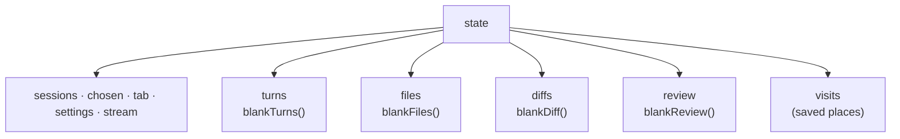

When you switch sessions, `choose()` throws all the bags away and makes blank
ones. Then `usePlace` puts back only what *you* chose for that session: where
you scrolled, which file was open, which folders were shut. The table
`PLACE_FIELDS` lists those fields, once. Everything else — the file text, the
diff, the transcript — is fetched again.

### Drawing only what changed

Each tab has an entry in `TABS`: how to draw it, how to load it, and how often
to poll it.

| Tab | Draw | Updates by |
| --- | --- | --- |
| Transcript | `drawTranscript` | the push (no poll) |
| Files | `drawFiles` | a poll every 2 s |
| Review | `drawDiff` | a poll every 5 s |

A poll every two seconds must not rebuild the page every two seconds. That
would reset your scroll, close your menus, and burn your battery. So drawing
goes through one small gate:

```js
function fresh(box, which, key) {
  if (box.dataset[which] === key) return false;
  box.dataset[which] = key;
  return true;
}
```

A part is drawn again only when its *key* changed. The key is built from the
inputs of the drawing. For the Review tab, `diffKey()` joins the session, the
diff's tag, the open files, the find box, the columns and a few more. If none
of them moved, nothing is drawn.

The transcript works the other way round. It has no poll. The push delivers
only the changed blocks, and `patchTranscript` redraws those blocks and
appends the new ones.

### The sidebar

The sidebar sorts sessions into four groups (`BANDS`), most urgent first:
**needs you**, **working**, **ready**, and **history**. Rows are made once
(`newRow`) and then only filled (`fillRow`). A row is never rebuilt, so its
colour can fade and its pulse can keep its rhythm.

The sidebar also feeds three signals that work from another room:

- the **tab title** names the agents that need you ("api-fix asks · wostuast");
- the **tab icon** is a small robot drawn on a canvas, in the colour of the
  most urgent state;
- a **browser alert** fires once when an agent starts to need you, and,
  if you want, when one finishes.

A session that needs you can be **snoozed**: "not now" on its row, or `z`.
It then stands with the ready ones, and none of the three signals counts
it. The snooze is a mark on one wait (`attention_since`), so the next
answer, turn or question ends it by itself.

### Markdown you can trust

Agents write Markdown. They also read web pages and files, and may repeat what
they read. So **the page never trusts what an agent wrote**:

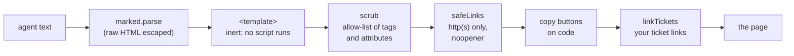

The page builds DOM nodes. It never builds markup from agent text. Even the
output of highlight.js is scrubbed down to its own `hljs-*` spans.

### Big files

A file of 40,000 lines is 2.8 seconds of drawing if you draw it whole. So:

- Up to `CODE_WHOLE` lines, a file is drawn whole and coloured.
- Above that, only the rows on screen exist (`fillCode`). Scrolling builds the
  next rows. A redraw takes about 5 ms.
- A minified file (very long lines) is not coloured at all. highlight.js once
  took up to four seconds on a 500 KB one-line bundle.

The file list does the same: every row is the same height, so the list builds
only the rows you can see. A repository with 52,799 files scrolls smoothly.

### The review

The Review tab shows the diff of the worktree against its base. You can click
a line and write a comment on it. Each comment has an *anchor*: the path and
the line number in the worktree (`anchorOf`). When the agent changes the file,
the comment stays on its line.

When you are done, you press send. `reviewText` turns the comments into plain
text — the file and line, the quoted code, your note — and the daemon types it
into the agent's pane. You see every byte before it goes. The draft lives in
your browser's storage until it is sent, so a reload loses nothing.

> [!NOTE]
> **A half-written comment is sacred.** The page polls the diff every few
> seconds. A redraw under an open comment box would throw away what you typed.
> So `holdingText` stops redraws of the diff body while a box is open, and
> `busyWriting` refuses controls that would remove the line the box hangs on.

### Colours

Every colour is a CSS variable, defined in one `:root` block for the dark
theme and one for the light theme. A test fails the build if a colour appears
anywhere else. Tints are mixed from the palette with `color-mix`, never typed
in by hand. This is why the two themes stay consistent.

---

## Chapter 9. Back to the terminal: four verbs and no more

Everything so far *reads*. This chapter is about the only part that *writes* to
a terminal. It is small on purpose.

| Verb | Route | tmux commands | What you see |
| --- | --- | --- | --- |
| **jump** | `jump` | `select-window`, `select-pane` | tmux shows the agent's pane. |
| **send** | `send` | `load-buffer`, `paste-buffer`, for the text and then for Enter | Your text appears as a prompt. |
| **answer** | `answer` | each key pasted as its bytes (digits, Tab, Enter) | The agent's question is answered. |
| **no** | `decline` | Escape pasted as its byte, then a send | The permission dialog closes with No, and your reason follows. |

Only six tmux commands are ever used: `select-window` and `select-pane` to
jump; `send-keys` to leave copy mode; and `load-buffer`, `paste-buffer`
and `delete-buffer` to type a text or a key. A key is pasted as its bytes
too, never pressed with `send-keys`: with `synchronize-panes` on, a key goes
to every pane of the window, and a paste only to its own. The Escape is
pasted with `-S`: tmux 3.7 otherwise writes it as the two characters `^[`.
An older tmux refuses `-S`, and the Escape is pasted again without it.
Adding a seventh command needs a very good reason.

### How a text is typed

A text goes in as one paste, not as keys:

1. `send-keys -X cancel` takes the pane out of copy mode, if you left it
   scrolled back. In copy mode the paste would lose its markers, and the
   Enter would go to the mode.
2. `load-buffer` reads the text on stdin into a tmux buffer. The buffer has
   a name of its own, so no other paste can take it.
3. `paste-buffer -p -r` writes it into the pane, and deletes the buffer.
   `-p` puts the paste markers around it when the program asked for them,
   as Claude Code does. So the agent knows that all of it is one paste, and
   a newline in it does not submit the prompt. `-r` keeps a newline a
   newline.
4. One carriage return, pasted the same way but without the markers, is
   the Enter. A paste goes only to its pane; a key would go to every pane
   of a window with `synchronize-panes` on.

If a paste fails, its buffer is deleted and nothing more is typed.

Why not `send-keys` with the text? tmux refuses a command longer than about
16 KB, and a long log is longer. And Claude Code read a long line that came
without the paste markers as several pastes, with the Enter inside the last
one, so the prompt was not submitted.

### Saying No, safely

A permission dialog carries no id. When you press **no** in the browser, how
do we know that the dialog on screen is the one you read? We cannot know it in
advance. So we prove it afterwards:

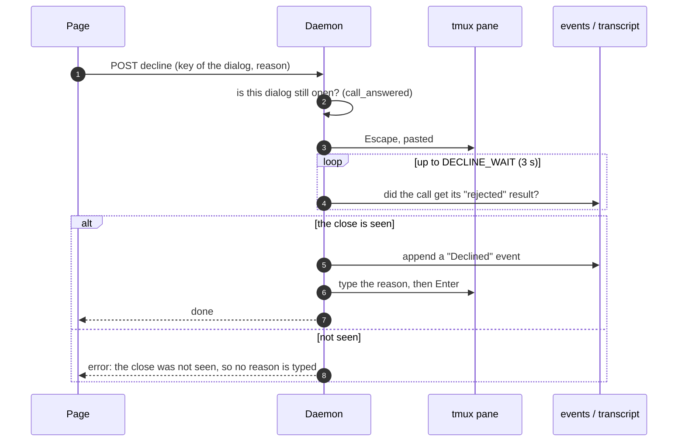

Before the Escape, the daemon checks that the call has no result yet, so the
dialog you read is still the one on screen. The *reason* is a prompt, and a
prompt typed into the wrong place does harm. So the reason is typed only after
the daemon has seen proof that the dialog closed with No.

There is no **Yes** button, and there will not be one. See
[Chapter 1](#chapter-1-what-we-build-and-what-we-do-not).

### One write at a time

Two quick clicks must not type two texts into one pane, mixed together.
`Daemon.claim` keeps a set of sessions that are being typed into. A second
request for the same session is refused with 409, not queued. The page shows
why, and you can try again.

### What may reach a terminal

Text from the page goes through `CONTROL_CHARS` before it reaches tmux. That
strips control characters, line and paragraph separators, and lone surrogates
— everything that could move the cursor, change the terminal's mode, or hide
part of a command. A text over `SEND_MAX` (1 MiB) is refused, never cut:
Claude Code took 1.36 MB as one prompt, and refused 5 MB as too large for
the context.

---

## Chapter 10. Safety in layers

wostuast serves a page that can type into your terminals. That is power, so it
is guarded in layers. Each layer stops a different attacker.

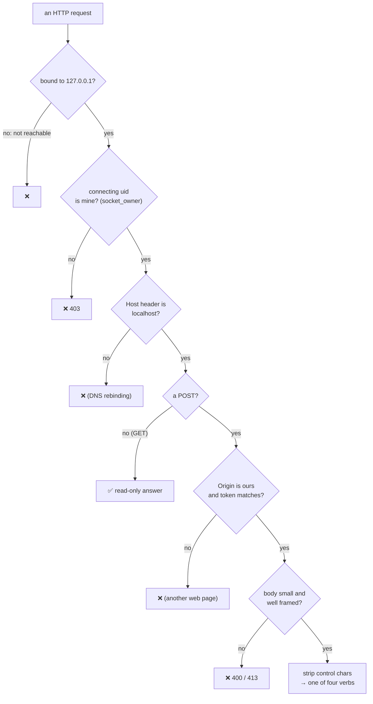

| Layer | Stops | How |
| --- | --- | --- |
| Loopback only | other machines | `BIND_HOST = "127.0.0.1"`. Use an ssh tunnel to reach it from elsewhere. |
| The uid check | other users on the same machine | `another_user` reads `/proc/net/tcp` to find who owns the other end of the socket. |
| The Host check | DNS rebinding | `ours()` accepts only `localhost`, `127.0.0.1` and `::1`. |
| Origin + token | other web pages in your browser | Every POST needs a loopback `Origin` and the secret token in a header. The token is written into the page, never into a URL. A POST without them is refused before its body is read. |
| Framing | smuggled requests | `body_length` refuses anything but a clear `Content-Length`; `POST_MAX` caps the size. |
| Headers | clickjacking, sniffing | `X-Frame-Options: DENY`, `frame-ancestors 'none'`, `nosniff`; no CORS header, ever. |
| Control characters | escape sequences | `CONTROL_CHARS` and `SEND_MAX`. |
| Four verbs | everything else | Nothing else in the program writes to a terminal. |

And on the disk:

- The state directory is `0700`, and every file in it is `0600` **from the
  moment it is created** (`open_private`, `write_atomic`). There is no window in
  which another user could read it.
- Files are replaced atomically: write a temporary file, then rename it.
- A remote URL or a command shown on the page has its secrets hidden
  (`hide_secrets`), so a token in a git remote does not end up on screen.

> [!WARNING]
> **Claude Code's `settings.json` is your file, not ours.** `install` adds its
> entries and touches nothing else. It keeps your indentation, your file mode,
> and your symlinks. `uninstall` removes only the entries that are ours, and
> puts your own status line back.

---

## Chapter 11. Install, update, uninstall

The life cycle is three commands, and one of them runs by itself.

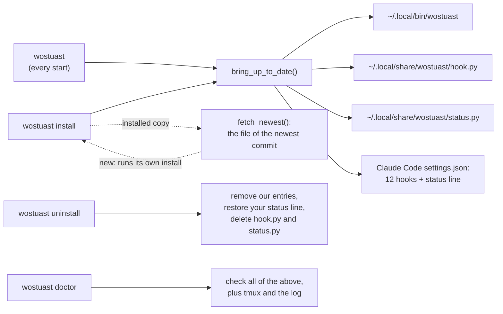

- **`bring_up_to_date`** is shared by `install` and every start of the daemon.
  It writes a file only if its content differs, and saves `settings.json` only
  if the JSON changed.
- **An update is `wostuast install`.** The installed copy asks GitHub which
  commit last changed the program, downloads the file at that commit, gives
  it the commit's time, and runs the install of the new copy, because the
  new program builds the new hook file (`fetch_newest`). A copy in a clone
  installs itself and goes to no network, so a branch you try is not
  replaced by `main`. A bare start never goes to the network.
- **The version is the file**, not a number: the day it was made and the
  start of its SHA-256 (`own_version`). `--version`, the start and the page
  all print it.
- **`uninstall`** keeps your event log and the program file. It tells you the
  one command to delete the program too.
- **`doctor`** checks Python, the state directory, the log, every hook entry,
  the status line, tmux, our settings file, and whether the hook files are the
  ones this version would write.
- **`files`** lists every file wostuast wrote, grouped, with what it is for
  and what `uninstall` does to it (`installed_files`).
- **`report`** prints all of that, and more, as Markdown for an AI agent that
  works on wostuast: versions, the hook events and payload fields of the last
  days, the ones wostuast does not handle yet, the transcript records the page
  cannot show, errors by kind, and what the hook costs. It holds names, counts,
  sizes and timings only, never your text, so it can go into an issue.

Our own settings live in `~/.config/wostuast/settings.json`: colours, alerts,
tab width, long lines, diff columns and ticket links. Every setting in it is a
control in the page's settings menu. Nobody has to write the file by hand, and
wostuast runs fine without it.

---

## Chapter 12. The speed budget

A tool that watches must be cheaper than the work it watches. These are
measurements somebody made, with the reason each one mattered.

| What | Before | After | How |
| --- | --- | --- | --- |
| One hook event | 131 ms | 33 ms | a generated `hook.py` (#271) |
| One status line | 127 ms | about 45 ms | a generated `status.py` (#286) |
| Daemon memory on a year of logs (200 MB) | 641 MB | 28 MB, flat | read in chunks, forget the quiet |
| An unchanged file list over a slow link | 1.7 MB | 0.2 KB | `?have=` tags |
| 2.5 MB of file names | 2.5 MB | 109 KB | gzip |
| A redraw of a huge file | seconds | about 5 ms | draw only the rows on screen |
| One append to the log | — | about 0.1 ms | `flock`, not SQLite (2 ms) |
| One poll of the diff on a 2,500-file branch | about 300 ms | only the uncommitted part is asked again | cache the committed part (#291) |

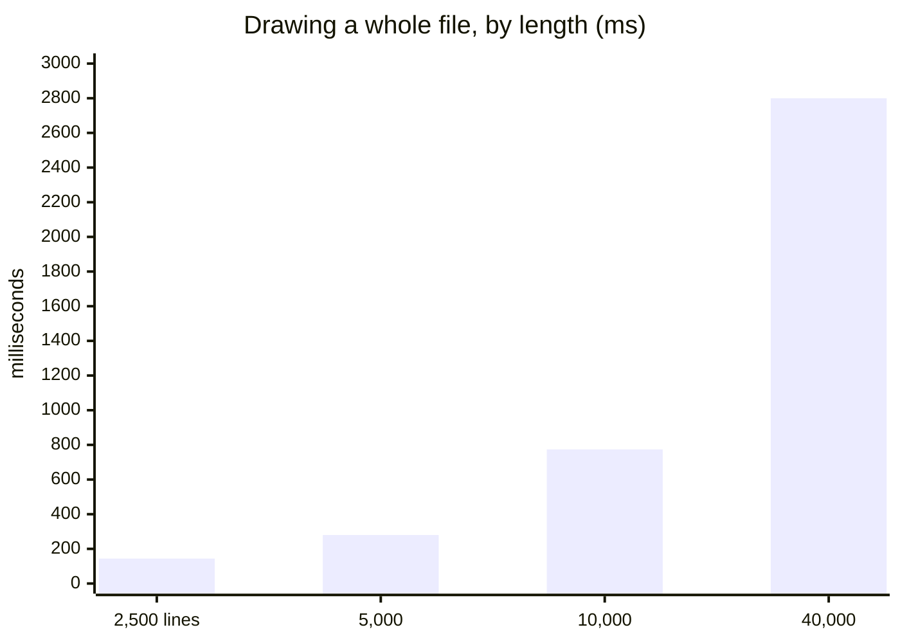

The chart shows why long files are drawn in windows. The cost grows faster
than the length.

---

## Chapter 13. How we test it

Most of the tests drive a **real Chromium** through Playwright, against a real
daemon, with real git repositories in temporary folders. A test of the page is
a test of what you would see.

Three habits make the suite trustworthy:

1. **A test is not a test until it has failed.** `tests/perturb.py` breaks the
   code on purpose — one small change at a time — and runs only the tests that
   should notice. If they stay green, the test proves nothing, and we fix it.
2. **Run it under load.** Many bugs appear only when twelve browsers run at
   once. Changed test files run three times in parallel before a push.
3. **Look at a picture.** `tests/shot.py` and `tests/stage.py` draw any part of
   the page to a PNG, from a few lines of input. A spacing bug that three tests
   "proved fixed" was still visible in the first picture.

Tests that need no browser cover the session model, the log reader, the git
helpers, the install, and every safety check. CI runs everything on Python 3.10
to 3.13, with the browser tests split into shards.

---

## Chapter 14. Roads not taken

Every design is also a list of things we decided against. Here are the big
ones, and why.

| We could have… | We did not, because… |
| --- | --- |
| used the **Agent SDK** or `stream-json` | They need wostuast to start and own the agent. They cannot attach to an interactive session in tmux. |
| used an **`http` hook** | It records nothing while the daemon is down. |
| used **decision hooks** | A hook that can say "allow" can approve something nobody saw. |
| used **inotify** | It is a dependency, and the scale is tens of files. A poll once a second is enough. |
| used **SQLite** | It costs 2 ms per write in the hook, and much more under contention. A plain scan of 400 MB takes 0.38 s. |
| used **OpenTelemetry** | Its settings belong to the company that sets up Claude Code, not to you. |
| added a **config file** for everything | If wostuast can work an answer out, it must. A setting that is the same for everybody is not a setting. |
| shown a **live copy of the pane** | The real pane is one keystroke away. A copy is a terminal emulator, which is a non-goal. |

> [!TIP]
> Before you build one of these, read [`.claude/topics/decisions.md`](.claude/topics/decisions.md).
> It has the measurements behind each "no".

---

## Epilogue: where to go next

You now know the shape of the whole program. Some good next steps:

- **Read the code of one flow end to end.** For example: `cmd_hook` →
  `append_event` → `EventFollower.new_lines` → `Store.fold` →
  `_on_permission_request` → `Daemon.tick` → `Hub` → the page's `sessions`
  handler → `drawSessions`. It is the "who needs me?" path, and it fits in one
  afternoon.
- **Read [`CLAUDE.md`](CLAUDE.md).** It is the map for changing the code: where
  each rule lives, which helpers already exist, and how to work.
- **Read one file in [`.claude/topics/`](.claude/topics/)** before you touch its part.
  Each rule there is a bug that already happened once.
- **Run `wostuast doctor`.** It explains your own install in a few lines.

wostuast is small because it says no often. Most of its code is not features.
It is care: for your terminal, your files, your attention, and your time.

---

## Glossary

| Term | Meaning |
| --- | --- |
| **agent** | One Claude Code session, running in a tmux pane. |
| **session** | wostuast's model of one agent: a `Session` object, keyed by Claude Code's session id. |
| **hook** | A command Claude Code runs on an event. Here: `hook.py`. |
| **event log** | `~/.local/state/wostuast/events.jsonl`: one JSON line per hook event. Plus its archives, `events.N.jsonl`. |
| **daemon** | The running `wostuast` command: it reads the log and serves the page. |
| **page** | The single web page the daemon serves. |
| **pane** | A tmux pane, named like `%7`. The agent runs in it. |
| **needs you** | The state of an agent that is blocked on you. Shown in amber. |
| **transcript** | Claude Code's own JSONL file for a session: everything said and done. |
| **block** | One item of a transcript on the page: a prompt, a reply, a thought, or a tool call. |
| **tick** | One round of the daemon's worker: read the log, update the model, push changes. |
| **push** | An event the daemon sends down the SSE stream to the page. |
| **tag**, **stamp** | A short value that says "this is the version you already have". The answer is then `same`. |
| **base** | The commit a diff starts from: the branch the work was cut from. |
| **anchor** | Where a review comment belongs: a path and a line. |
| **verb** | One of the four ways the page acts on a terminal: jump, send, answer, no. |
