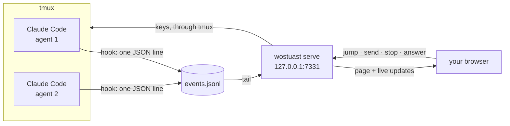

<div align="center">

# wostuast

**See what your Claude Code agents are doing: who needs you, what they said, what they changed.**

*"wos tuast?"* is Austrian for *"what are you doing?"*

[](https://github.com/martinus/wostuast/actions/workflows/tests.yml)


[](LICENSE)

[Is it for you?](#is-it-for-you) · [How it works](#how-it-works) · [Install](#install) · [The page](#the-page) · [Keys](#keys) · [Commands](#commands) · [FAQ](#faq)

</div>

---

You run several Claude Code agents, one per tmux window. A terminal is a good
place to type and a bad place to read. **wostuast is the reading side.** It is
one page in your browser. It tells you which agent needs you, what each agent
said, and what each agent changed.

```text
$ wostuast ls

STATE      SESSION                                   BRANCH          CHANGES  PANE  AGE    LAST
needs you  Add substring search · oans/warmhare      feature/search  ↑2 ●5    %7    38s    permission: Bash cmake --build build -j
working    Speed up the table render · oans          main            ●1       %9    4s     Edit src/table.cpp
ready      Fix issue 142 · unordered_dense/calmpuma  fix/issue-142   ↑1 ✓     %11   4min   stopped

1 needs you · 1 working · 1 ready
```

## Is it for you?

| Try it if you… | Skip it if you… |
| --- | --- |
| run more than one Claude Code session at a time | run one agent and watch it in its terminal |
| run those sessions in tmux | do not use tmux, and want to answer and send from the page (reading works without it) |
| want to know from another window, or another room, which agent is waiting | want a hosted dashboard for a team |
| read diffs and plans more than you type prompts | want to approve permission prompts from a browser (wostuast can only decline them) |
| want one file, no install step, and nothing leaving your machine | want a desktop app |

## What you get

- **You see who needs you.** The session list is grouped by state, most urgent
  first. The browser tab's title and icon show the count, so a tab in the
  background still tells you. Your browser can also notify you.
- **Each session is one card.** It shows the session's name and its age,
  the repository and the worktree, the branch and its git status, and what
  the agent is doing now. Hover over the repository to see its remote, or
  over the worktree to see its path. The colour of the card shows the state.
- **You answer an agent's question from the page.** When an agent asks you
  something, the question and its answers show at the foot of the transcript.
  Pick one answer, or several where the question allows it. Change your mind
  if you want. Nothing goes to the terminal until you press submit, and the
  button says which keys it will press.
- **You can say No to a permission request.** The page shows the whole
  request: every field, not a clipped line. Press **no**, and add what the
  agent should do instead if you want to. It never offers **yes**: approving
  stays in the terminal, one click away.
- **You review its work like a pull request.** Click the `+` beside a line in
  the diff or in a file, and write what you want changed. The comments collect
  into one review. You read the whole message, then send it to the agent in
  one go. A comment belongs to a line in the file, so a comment on line 42 of
  the diff also shows on line 42 of the file.
- **You read the worktree without an editor.** Every file git knows about, with
  syntax colour. The diff against the branch the work was cut from. Files an
  agent generated into an ignored directory, such as a plan. Your ticket ids
  as links.
- **It stays fast on big repositories.** The names of 50,000 files cost 1.7 MB
  once, then about 200 bytes on each later check. A build directory with a
  hundred thousand objects is one row that says so.

> [!NOTE]
> **wostuast never owns your agents.** tmux does. wostuast reads files, and it
> sends only a few things to a terminal, always as keys typed into the agent's
> own pane: **jump** to the pane, **send** a message, **stop** (an Escape), the
> **answer** to a question the agent asked, and **no** to a permission
> request. It never approves a permission request.

## How it works



1. Claude Code runs a **hook** on every event. The hook appends one JSON line to
   `~/.local/state/wostuast/events.jsonl` and exits. It does not need the daemon
   to run, so nothing is lost while the daemon is down.
2. **`wostuast serve`** reads that log and the agents' transcripts, and serves
   one page on `127.0.0.1`. The page updates itself. There is no reload button,
   because there is nothing to reload.
3. When you act on the page, the daemon types into the agent's tmux pane.
   Nothing else writes to a terminal.

## Install

**You need:** Python 3.10 or newer, Claude Code, and tmux. git makes the Files
and Diff tabs work. No `pip install`, no build step, no config file.

**1. Install.** This copies one file to `~/.local/bin/wostuast` and adds its
hooks to `~/.claude/settings.json`. It changes nothing else in that file.

```sh
python3 -c "$(curl -fsLS https://raw.githubusercontent.com/martinus/wostuast/main/wostuast)" install
```

> [!IMPORTANT]
> Restart your Claude Code sessions after the install. A running session does
> not pick up new hooks.

**2. Check the setup.** `doctor` says what is missing, if anything.

```sh
wostuast doctor
```

**3. Open the page.**

```sh
wostuast serve --open
```

> [!TIP]
> **On another machine?** Forward the port over SSH:
>
> ```sh
> ssh -N -L 7331:127.0.0.1:7331 you@your-server
> ```
>
> Then open <http://127.0.0.1:7331> on your own machine. Opening a port in a
> firewall does not work: wostuast listens only on `127.0.0.1`, on purpose.

<details>
<summary><b>Uninstall</b></summary>

```sh
wostuast uninstall               # removes our hooks and our status line; keeps your history
rm ~/.local/bin/wostuast         # removes the program
rm -r ~/.local/state/wostuast    # removes the history too, if you want that
```

</details>

## The page

The page shows one session at a time, in five tabs. Each session remembers
where you left it: the tab, the open file, and your place in it.

| Tab | What it shows |
| --- | --- |
| **Transcript** | What the agent said and did, with a map of the conversation beside it. |
| **Files** | Every file in the worktree as a tree, with syntax colour and go-to-file. |
| **Diff** | What changed, file by file, in one column or side by side. |
| **Review** | The comments you wrote, as one message to send. |
| **Session** | Everything about this session, its event log, and the spend limit. |

<details>
<summary><b>More about each tab</b></summary>

#### Transcript

The map beside the transcript has one row for each thing you typed, with the
replies under it. Click a row to go there. Click its chevron to fold that round
away. When you scroll up, a round **↓** button at the foot of the transcript takes you back to the end. After a reload, the transcript and the map both open at the latest round.

#### Files

Every file git knows about, as a tree. Pictures show as pictures. Go to a file
by typing scattered letters of its name: `mbldr` finds `MetricBuilder.h`. An
ignored directory that an agent generated files into is in the tree too. A
folder with thousands of files in it is one row that says it is not listed.

#### Diff

Changed files as a tree, and each file's diff in colour, with the changed
words marked.

- **Pick what to show:** all changes, only what is not committed, or one
  commit with its whole message. Step through the commits with **older** and
  **newer**.
- **All changes has two halves**, and each half says what it is a diff of:
  what this branch committed that its base branch does not have, and what the
  files on disk hold that the last commit does not.
- **The base branch is the one the branch was cut from:** the default branch
  for a feature, or a release branch for a backport. If wostuast finds the
  wrong one, pick another beside the commit picker. Your browser keeps that
  choice for the worktree.
- **Hidden lines:** where lines are hidden between changes, a band says how
  many. Show twenty more from either end, or all of them.
- **Untracked files** are listed on their own, because git has no diff for
  them.

#### Review

The comments you wrote, collected into one message. You read the whole message
before it goes to the agent. Nothing in it can be edited on the way.

#### Session

The worktree, branch, model, context window, pane, and the session's own event
log. You can rename a session here too. It also has two controls:

- **stop** presses Escape in the agent's pane. That ends the turn and keeps
  the work done so far.
- **stop at** takes a number of dollars. When the session's spend passes it,
  wostuast presses Escape for you, one time. Raise the number to let the agent
  go on.

</details>

How full the context window is, and what the session has spent, show at the
end of the tab row. You see both on every tab.

> [!WARNING]
> The spend is Claude Code's own estimate at list price. It can differ from
> your bill, and it starts again at zero after `/clear`. Use **stop at** as a
> brake, not as a budget.

### Alerts

The **bell** at the end of the tab row opens two switches. One tells you when an agent needs
you. The other tells you when an agent has finished. The first is on as soon as
you allow alerts, because that is what this tool is for. The second is off
until you turn it on. Both use your browser's own notifications, so the
browser asks for permission the first time. Your choice stays in that browser.

## Keys

Press <kbd>?</kbd> on the page to see this list.

| Key | What it does |
| --- | --- |
| <kbd>j</kbd> <kbd>k</kbd> | Move down and up the session list |
| <kbd>n</kbd> | Go to the next session that needs you |
| <kbd>f</kbd> | Filter the session list |
| <kbd>e</kbd> | Rename the chosen session (or double-click its name) |
| <kbd>/</kbd> | Find in the tab's list: a turn, a file, a comment |
| <kbd>r</kbd> | Open the review you wrote |
| <kbd>1</kbd> – <kbd>5</kbd> | Transcript, Files, Diff, Review, Session |
| <kbd>Enter</kbd> | Jump to the agent's tmux pane |
| <kbd>s</kbd> | Type into the agent's terminal |
| <kbd>t</kbd> | Show or hide the agent's thinking, and say how much there is |
| <kbd>c</kbd> | Colours: auto, light, dark (the last button in the tab row does the same) |
| <kbd>Esc</kbd> | Clear a box, or close the help |

**Jump** puts the cursor in the agent's pane. To also raise your terminal
window, set `WOSTUAST_FOCUS` to a command that does that. Which command that
is depends on your window manager.

## Commands

| Command | What it does |
| --- | --- |
| `wostuast install` | Copy to `~/.local/bin`, and register the hooks and the status line. |
| `wostuast uninstall` | Remove our hooks and our status line. Keep the event log. |
| `wostuast ls` | List the sessions, in the same order as the page. |
| `wostuast doctor` | Check Python, the state directory, the log, the hooks, and tmux. |
| `wostuast serve` | Start the daemon and serve the page on `127.0.0.1:7331`. `--port` picks another port, `--open` opens a browser. |
| `wostuast hook` / `status` | Claude Code calls these. You do not. |

`install` also registers `wostuast status` as your Claude Code status line, but
only if you do not have one. The status line carries the session's
context usage and its spend; hooks carry neither. Without it, wostuast
still works, but sessions have no context bar and no spend. If you
keep your own status line, `install` tells you the line to add to it.

## Files

Everything wostuast writes is on your machine, in private files (`0600`, in
`0700` directories).

| Path | What it holds |
| --- | --- |
| `~/.local/bin/wostuast` | The program. One file. |
| `~/.local/state/wostuast/events.jsonl` | Every event, one JSON object per line. At 20 MB it moves to `events.1.jsonl`, then `events.2.jsonl`, and so on. No file is deleted: this is your history. |
| `~/.local/state/wostuast/status/<session>.json` | The latest status of one session. |
| `~/.local/state/wostuast/wostuast.log` | What went wrong, if anything. Rotates at 5 MB. |
| `~/.local/state/wostuast/links.json` | Your own ticket links, if you want any. |
| `~/.claude/settings.json` | Where the hooks are registered. |

### Ticket links

If your work has ticket ids in it, they can become links. `serve` writes an
example `links.json` the first time it runs, so you only edit it:

```json
[
  {"match": "(OA|QSP)-(\\d+)", "url": "https://tickets.example.com/browse/$1-$2"}
]
```

`match` is a regular expression. `url` is where a match links to, and `$1` to
`$9` are the groups of the match.

> [!CAUTION]
> **Write every backslash twice.** The file is JSON, so `\d` must be written
> `\\d`. If the file has a problem, wostuast says so: `serve` prints it, the
> Session tab shows it, and `doctor` reports it. Keep patterns simple, because
> a browser cannot stop a regular expression once it starts.

This is the one file you write. The program writes everything else in
`~/.local/state/wostuast/`.

## Safety

The page can type into a terminal, so it is careful about who may use it.

- It listens on `127.0.0.1` only, and refuses a request whose `Host` header is
  not its own.
- Every action carries a token that the daemon prints into the page. A token
  from before a restart is refused, and the page tells you to reload.
- No other site can show the page in a frame.
- What an agent wrote is shown as text or as cleaned Markdown, never as live
  HTML.
- Control characters never reach a terminal. A message with more than one line
  goes as one paste, so no line of it runs as a command on its own.

## FAQ

<details>
<summary><b>Does it work without tmux?</b></summary>

Reading works: the session list, all five tabs, and alerts. The four things
that type into a pane (jump, send, stop, answer) need tmux. Those controls are
off for a session with no pane, and the page says why.

</details>

<details>
<summary><b>Does it work on macOS?</b></summary>

Yes. On Linux, wostuast checks that an agent's process is still alive. macOS has
no `/proc` to check, so there a quiet session is taken as ended after twelve
hours.

</details>

<details>
<summary><b>Does it send anything anywhere?</b></summary>

No. The log, the status files and the review drafts stay on your machine. The
page itself fetches three things: its fonts from Google Fonts, and two
JavaScript libraries from cdnjs: `marked` for Markdown and `highlight.js` for
syntax colour. Each library is pinned by a hash of its bytes. The page works
without all three: it falls back to your system fonts, Markdown shows as plain
text, and code shows without colour.

</details>

<details>
<summary><b>Can it approve a permission prompt for me?</b></summary>

No, and it never will. Approving without seeing the pane is how directories get
deleted, and a dialog carries no id, so the page cannot prove which one a click
would land on. The row goes amber and waits for you.

It can **decline** one. The page shows the whole request, and **no** presses
Escape in the agent's pane. If you write what the agent should do instead,
wostuast types it only after it has seen the dialog close, in the transcript.
Until then a reason could land in the dialog itself, where a digit picks an
option. A wrong No is easy to undo, and a wrong Yes is not.

Answering a question the agent asked (`AskUserQuestion`) is different again:
that is the agent's own question, and nothing is typed until you press
submit.

</details>

<details>
<summary><b>Where does the name of a session come from?</b></summary>

From you. A new session is called by its repository and worktree, for
example `agent/richpalm`. To give it a name, double-click the name in the
session list, or press <kbd>e</kbd>. Press <kbd>Enter</kbd> to keep the name,
or <kbd>Esc</kbd> to cancel. An empty name gives the session back its
repository and worktree.

The title that Claude Code gives a session does not change when you use
`/rename`, so the list does not show it. The Session tab does.

</details>

## No screenshots

A screenshot of this page is a screenshot of somebody's agents, and made-up
ones would show a tool nobody is using. Run `wostuast serve --open` instead:
one command, and it shows you your own.

## Status

All seven planned milestones are done. [`CLAUDE.md`](CLAUDE.md) holds the
design, the reasons behind it, what was left out on purpose, and how to work in
this repository.

## License

MIT. See [LICENSE](LICENSE).
