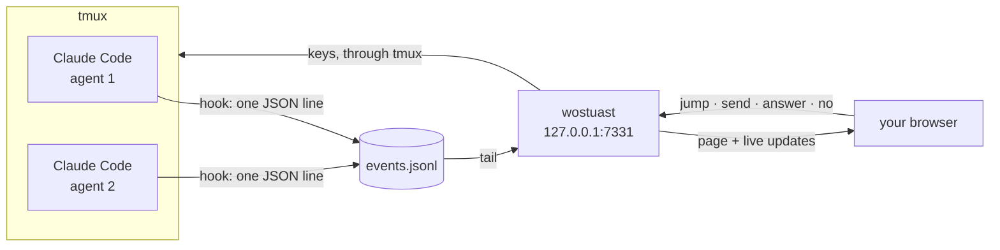

<div align="center">

# wostuast

**See what your Claude Code agents are doing: who needs you, what they said, what they changed.**

*"wos tuast?"* is Austrian for *"what are you doing?"*

[](https://github.com/martinus/wostuast/actions/workflows/tests.yml)


[](LICENSE)

[Is it for you?](#is-it-for-you) · [How it works](#how-it-works) · [Install](#install) · [The page](#the-page) · [Keys](#keys) · [Commands](#commands) · [FAQ](#faq)

</div>

---

You run several Claude Code agents, one per tmux window. A terminal is a good
place to type and a bad place to read. **wostuast is the reading side.** It is
one page in your browser. It tells you which agent needs you, what each agent
said, and what each agent changed.

```text
$ wostuast ls

STATE      SESSION                                   BRANCH          CHANGES  PANE  AGE    LAST
needs you  Add substring search · oans/warmhare      feature/search  ↑2 ●5    %7    38s    permission: Bash cmake --build build -j
working    Speed up the table render · oans          main            ●1       %9    4s     Edit src/table.cpp
ready      Fix issue 142 · unordered_dense/calmpuma  fix/issue-142   ↑1 ✓     %11   4min   stopped

1 needs you · 1 working · 1 ready
```

## Is it for you?

| Try it if you… | Skip it if you… |
| --- | --- |
| run more than one Claude Code session at a time | run one agent and watch it in its terminal |
| run those sessions in tmux | do not use tmux, and want to answer and send from the page (reading works without it) |
| want to know from another window, or another room, which agent is waiting | want a hosted dashboard for a team |
| read diffs and plans more than you type prompts | want to approve permission prompts from a browser (wostuast can only decline them) |
| want one file, no install step, and nothing leaving your machine | want a desktop app |

## What you get

- **You see who needs you.** The session list is grouped by state, most urgent
  first. The browser tab tells you too, when it is in the background. Its
  title names the sessions that need you, or else says how many are working
  or ready. Its icon is a small robot with one big eye and one small eye.
  The whole robot is grey when nothing waits, green while an agent works,
  and amber when one needs you. Your browser can also notify you. An agent
  that an API error stopped, for example a spend limit or a failed login,
  needs you too: its card says the error.
- **You can say "not now".** Point at a card that needs you and click the
  moon (or press <kbd>z</kbd>). The session then stands with the ready
  ones, and the tab's title, its icon and the alerts leave it out. The
  snooze ends by itself when the session moves on: you answer, the turn
  ends, or it asks something new. The sun on the card ends it by hand.
- **You search every session.** "Search" under the filter box finds what
  you typed and what each agent answered last, in every session, newest
  first. Slack's filters work: `in:name`, `from:me`, `from:claude`,
  `after:2026-10-01`, `before:2026-10-03`, `is:unread`.
- **You keep an answer or a prompt for later.** Hover it and click the
  bookmark before "claude" or "you". "Saved" over the list shows every
  saved turn of every session, with "open" to go back to it and "done" to
  take it off.
- **You find a command.** "Commands" over the list (or <kbd>4</kbd>) shows
  every skill and command your sessions can run: your own from
  `~/.claude` and the built-in ones you have run, then each project's
  under its name. Choose one to read it; **use** puts it into the send
  box of a session that can run it.
- **You catch up in one scroll.** "Unread" over the list shows the last
  answer of every unread session, newest first, as Markdown. Each is a
  card in its session's colour: click it to open the session, or point at
  it for "mark read". <kbd>Esc</kbd> goes back to the session.
- **You can say "later".** Point at a card, click the clock and pick: in
  30 minutes, in an hour, in three hours, tomorrow at 08:00, Monday at
  08:00, or "Custom…" for a day and a time of your own. Until then
  the card shows a clock and the time it comes back, and a session that
  waits stands with the ready ones, as with "not now". Then it needs you
  again, whatever it is doing: the card turns amber and says "reminder",
  and the tab and the alert tell you.
  Opening the session ends the reminder. An alert needs a page open.
- **You see what you have not read.** A session whose turn ended after you
  last looked at it has a bold name with a blue dot before it, and the
  tab's title counts them. Opening it marks it read. The dot on a card's
  hover, or <kbd>u</kbd>, marks it unread again: you looked, but you are
  not done with it. Every browser sees the same marks. When you open it,
  a blue "new" line stands over the first turn you have not seen, and the
  transcript opens there instead of at its end.
- **Each session is one card.** It shows the session's name and its age,
  the repository and the worktree, the branch and its git status, and what
  the agent is doing now. Hover over the repository to see its remote, or
  over the worktree to see its path. The colour of the card shows the state.
  In a command shown on one line, what looks like a password or a token is
  hidden as `***`: the user and password in a URL, `-u user:password`,
  `Authorization:` headers, `TOKEN=…`, and known token shapes. A secret in
  another shape still shows.
- **You answer an agent's question from the page.** When an agent asks you
  something, the question and its answers show at the foot of the transcript.
  Pick one answer, or several where the question allows it. Change your mind
  if you want. Nothing goes to the terminal until you press submit, and the
  button says which keys it will press.
- **You can say No to a permission request.** The page shows the whole
  request: every field, not a clipped line. Press **no**, and add what the
  agent should do instead if you want to. It never offers **yes**: approving
  stays in the terminal, one click away. While the dialog is up, the send
  box is gone, because its Enter would say yes. A plan that asks to start
  is in the transcript, drawn as a document, and the dialog points at it.
- **You review its work like a pull request.** Click the `+` beside a line in
  the diff or in a file, and write what you want changed. The comments collect
  into one review. You read the whole message, then send it to the agent in
  one go. A comment belongs to a line in the file, so a comment on line 42 of
  the diff also shows on line 42 of the file.
- **You read the worktree without an editor.** Every file git knows about, with
  syntax colour. The diff against the branch the work was cut from. Files an
  agent generated into an ignored directory, such as a plan. Your ticket ids
  as links.
- **It stays fast on big repositories.** The names of 50,000 files cost 1.7 MB
  once, then about 200 bytes on each later check. A build directory with a
  hundred thousand objects is one row that says so.

> [!NOTE]
> **wostuast never owns your agents.** tmux does. wostuast reads files, and it
> sends only a few things to a terminal, always through tmux into the agent's
> own pane: **jump** to the pane, **send** a message, the **answer** to a
> question the agent asked, and **no** to a permission request. It never approves a permission request.
> A message goes in as one paste, so it can be long: a log of up to 1 MiB.

## How it works


```mermaid
flowchart LR
    subgraph tmux["tmux"]
        A1["Claude Code<br/>agent 1"]
        A2["Claude Code<br/>agent 2"]
    end
    A1 -- "hook: one JSON line" --> L[("events.jsonl")]
    A2 -- "hook: one JSON line" --> L
    L -- "tail" --> D["wostuast<br/>127.0.0.1:7331"]
    D -- "page + live updates" --> B["your browser"]
    B -- "jump · send · answer · no" --> D
    D -- "keys, through tmux" --> tmux
```

1. Claude Code runs a **hook** on every event. The hook appends one JSON line to
   `~/.local/state/wostuast/events.jsonl` and exits. It does not need the daemon
   to run, so nothing is lost while the daemon is down.
2. **`wostuast`** reads that log and the agents' transcripts, and serves
   one page on `127.0.0.1`. The page updates itself. There is no reload button,
   because there is nothing to reload.
3. When you act on the page, the daemon types into the agent's tmux pane.
   Nothing else writes to a terminal.

For the whole story — the hook, the daemon, the page, and why each one is
built the way it is — read [ARCHITECTURE.md](ARCHITECTURE.md).

## Install

**You need:** Python 3.10 or newer, Claude Code, and tmux. git makes the Files
and Review tabs work. No `pip install`, no build step, and no config file to
write: the page writes your settings file when you change a setting.

**1. Install.** This copies one file to `~/.local/bin/wostuast`, writes the
small hook it runs on every event to `~/.local/share/wostuast/hook.py` and the
small status line to `~/.local/share/wostuast/status.py`, and adds its hooks to
`~/.claude/settings.json`. It changes nothing else in that file. Both small
files are made from the program, so a hook takes about 30 ms and a status line
about 45 ms, not the 120 ms it takes to start the whole program.

```sh
python3 -c "$(curl -fsLS https://raw.githubusercontent.com/martinus/wostuast/main/wostuast)" install
```

> [!IMPORTANT]
> Restart your Claude Code sessions after the install. A running session does
> not pick up new hooks.

**2. Start it.** One command checks the setup, brings the program, the hook
file and the hooks up to date when they are behind, and serves the page. A
green line is right, a yellow one changed or is worth a look, and a red one
stops it. `wostuast doctor` is the long form of the check.

```sh
wostuast --open
```

```
wostuast · 2026-10-01 · 2a5ca39
  ✓ python 3.11.15 · tmux · git
  ✓ 12 hooks → ~/.local/share/wostuast/hook.py

  ▶ http://127.0.0.1:7331/      ctrl-c stops
    another computer: ssh -N -L 7331:127.0.0.1:7331 you@this-machine
  · read 48,210 events from 3 files (61.2 MB) in 2.4 s
```

It writes nothing that is already right, so a start with nothing to fix
leaves `~/.claude/settings.json` alone. After it did update something,
restart your Claude Code sessions.

**3. Update.** Run `wostuast install` again. It asks GitHub for the newest
wostuast, and when that is not the copy you have, it installs it and prints
the version before and after. Without a network, it says so and installs the
copy you have. Then restart your Claude Code sessions.

```sh
wostuast install
wostuast --version    # wostuast 2026-10-02 · 3f9a1c2
```

There is no version number. The version is the day the file was made, in
UTC, and the start of its SHA-256. For a copy that `install` got from GitHub,
the day is the day of its commit. Two copies with the same SHA-256 are the
same program.

> [!TIP]
> **On another machine?** Forward the port over SSH:
>
> ```sh
> ssh -N -L 7331:127.0.0.1:7331 you@your-server
> ```
>
> Then open <http://127.0.0.1:7331> on your own machine. Opening a port in a
> firewall does not work: wostuast listens only on `127.0.0.1`, on purpose.
>
> A slow link is fine. wostuast packs what it sends with gzip, so `ssh -C`
> adds little. A tab you come back to gets only what changed. The first
> look at the Files tab of a big repository is the largest thing it sends:
> the names of all the files, once per session.

<details>
<summary><b>Uninstall</b></summary>

```sh
wostuast uninstall               # removes our hooks, our status line and their two files; keeps your history
rm ~/.local/bin/wostuast         # removes the program
rm -r ~/.local/state/wostuast    # removes the history too, if you want that
```

</details>

## The page

The page shows one session at a time, in three tabs. Each session remembers
where you left it: the tab, the open file, and your place in it.

| Tab | What it shows |
| --- | --- |
| **Transcript** | What the agent said and did, with a map of the conversation beside it. For a session that is over, the command that brings it back (`claude --resume`), to copy. |
| **Files** | Every file in the worktree as a tree, with syntax colour and go-to-file. |
| **Review** | What changed, file by file, with your comments on it and the bar to send them. |

<details>
<summary><b>More about each tab</b></summary>

#### Transcript

The map beside the transcript has one row for each thing you typed, with the
replies under it. Click a row to go there. Click its chevron to fold that round
away. When you scroll up, a round **↓** button at the foot of the transcript takes you back to the end. After a reload, the page stays on the same session, and the transcript and the map both open at the latest round.

A very long message, such as a log you pasted, shows only its first lines.
Click **show all** under it to read all of it, and **fold** to make it short
again. While you search, a message that holds what you search for shows all
of it.

A command you run in Claude Code shows with its answer, in a fixed-width font:
a `!` command with what it printed, and a slash command such as `/model opus`
with what Claude Code answered. You can send a slash command from the send box
too. One that opens a menu, such as `/model` alone, opens it in the terminal:
press <kbd>Enter</kbd> to jump there and pick.

When the send box is three lines tall or more, it shows how much it holds
over the send button: the lines and the size, such as "2.4k lines" and
"112 KB". A message can be up to 1 MiB.

Type `/` at the start of the send box to see the commands that this session
has. The list shows the skills and command files of the project, from the
session's directory up to the top of the repository, then yours from
`~/.claude`, then the commands you used before in any session. The commands you
use most come first. Type more letters to narrow the list. <kbd>Tab</kbd> puts
the chosen command in the box, and so does <kbd>Enter</kbd> after an arrow key
or while what you typed is the start of the name. Otherwise <kbd>Enter</kbd>
sends what you typed. <kbd>Esc</kbd> closes the list. Plugin skills, and command files in a
subdirectory of `commands`, are not in the list yet.

A `/` after a space, in the middle of a message, opens the list too. There
it shows only skills and command files. Claude Code does not run a command
in the middle of a message, but it tells the agent that you named a skill,
and the agent can then use it. A built-in such as `/clear` works only at the
start.

Point at a code block in a reply to show a copy button at its top right. It
copies the block and nothing else.

An edit shows how many lines it added and removed. Click it to see the change
under it, drawn as the Review tab draws it, with the line numbers the file had at
that moment. A long change shows its first lines; the Review tab has all of it.

#### Files

Every file git knows about, as a tree. Pictures show as pictures. Go to a file
by typing scattered letters of its name: `mbldr` finds `MetricBuilder.h`. An
ignored directory that an agent generated files into is in the tree too. A
folder with thousands of files in it is one row that says it is not listed.
A Markdown file is drawn as Markdown. **Markdown | text** at the right of its
path shows its lines, so you can comment on one.

#### Review

Changed files as a tree, and each file's diff in colour, with the changed
words marked.

- **Pick what to show:** all changes (the picker says how many commits they
  hold), only what is not committed, or one commit with its whole message.
  The message is drawn as Markdown, and **Markdown | text** at the right of
  its subject shows it as it was written; this browser keeps your choice. It wraps at the edge of the
  window, and your ticket links work in it and in its subject. Step through
  the commits with **older** and **newer**; between them, "5 / 9" says which
  commit you read, counted from the oldest. Each commit starts at its top.
- **All changes has two halves**, and each half says what it is a diff of:
  what this branch committed that its base branch does not have, and what the
  files on disk hold that the last commit does not.
- **The base branch is the one the branch was cut from:** the default branch
  for a feature, or a release branch for a backport. If wostuast finds the
  wrong one, pick another beside the commit picker. Your browser keeps that
  choice for the worktree.
- **Hidden lines:** where lines are hidden between changes, a band says how
  many. Show twenty more from either end, or all of them.
- **Untracked files** are listed on their own, because git has no diff for
  them.

#### Commands

A stored prompt is a Claude Code command: a Markdown file in
`.claude/commands/` (or a skill in `.claude/skills/<name>/SKILL.md`), in
the project or in `~/.claude`. The Commands view lists them all, yours and
the built-ins first and then each project's, with how often you used each
one.

- **Choose one** to read its text, drawn as Markdown, with its file and
  what it takes after its name.
- **use** puts `/name ` into the send box of a session that can run it,
  on its Transcript tab, with the cursor after it. Add what it needs, and send. Nothing is typed into the
  terminal before you press send.
- A command in a subfolder of `commands/`, or one from a plugin, is not
  listed yet: the send box leaves them out too.

#### Your review

- **Comment** with the `+` beside a line, in this tab or in Files. Each
  comment has **edit** and **delete**.
- **The tree lists your comments** under the changed files. Click one to go
  to it.
- **Commented elsewhere:** a comment on a line this diff does not show
  stands at the end, with the lines around it.
- **The send bar** at the bottom shows while you have a review. Write a
  comment on the whole review in its top box. Under it stands the review
  exactly as the agent will get it, which you cannot edit there. Press
  **Send** to type it into the agent's pane.
- **delete review**, beside the comments in the tree, throws the whole review
  away on the second press.

</details>

The model and its effort level, how full the context window is, and what the
session has spent show at the end of the tab row, on every tab. Beside them,
the terminal icon jumps to the agent's tmux pane (or press <kbd>Enter</kbd>).

Click the model to change it or its effort level. The menu offers the model
names Claude Code knows (`opus`, `sonnet` and the others, each the newest of
its family), the full names of the models your sessions ran this week, and the
effort levels. Your pick is typed into the session as `/model` or `/effort`.
Claude Code then also makes it the default for new sessions.

> [!WARNING]
> The spend is Claude Code's own estimate at list price. It can differ from
> your bill, and it starts again at zero after `/clear`.

### Alerts

The **settings** button at the end of the tab row holds two switches for alerts. One tells you when an agent needs
you. The other tells you when an agent has finished. The first is on as soon as
you allow alerts, because that is what this tool is for. The second is off
until you turn it on. Both use your browser's own notifications, so the
browser asks for permission the first time. Your choice goes into your
settings file. The permission itself stays in each browser.
While alerts are off, the settings button carries a small crossed-out bell.

An alert says what the agent wants: the question it asks, the permission it
wants, or, when it has finished, the start of what you asked it. Under that
it says the folder and the branch. It shows the robot of the browser tab,
amber or grey. An alert that needs you stays until you click or close it.
Click an alert to open its session. Secrets in what an alert says are
hidden, because an alert can show on a locked screen.

### Settings

The **settings** button (the sliders, at the end of the tab row) holds all
the settings:

- **colours**: auto, light or dark. Each button shows the colours it gives.
- **alerts**: see above.
- **tab**: the tab width, 2, 4 or 8, for the Files and the Review tabs.
- **lines**: long lines scroll or wrap, for the Files tab and the one-column diff.
  A very long file is drawn a part at a time and cannot wrap; it says so.
- **diff**: one column, or two side by side. Two columns always wrap.
- **links**: your ticket links. See [Ticket links](#ticket-links).

A change applies at once. The page writes it to
`~/.config/wostuast/settings.json` (or `$XDG_CONFIG_HOME/wostuast/`), and
the menu shows that path at the bottom. Every open page gets the change,
in every browser. You can also edit the file by hand while `wostuast` runs:
the page gets the change in about a second.

## Keys

Press <kbd>?</kbd> on the page to see this list.

| Key | What it does |
| --- | --- |
| <kbd>f</kbd> | Filter the session list |
| <kbd>e</kbd> | Rename the chosen session (or double-click its name) |
| <kbd>b</kbd> | Back to the session you looked at before; press again to return |
| <kbd>z</kbd> | Snooze the chosen session that needs you, or wake it |
| <kbd>u</kbd> | Mark the chosen session unread, or read |
| <kbd>/</kbd> | Find in the tab's list: a turn, a file, a comment |
| <kbd>1</kbd> – <kbd>3</kbd> | Transcript, Files, Review |
| <kbd>4</kbd> | Commands, the view of every project's skills and commands |
| <kbd>Enter</kbd> | Jump to the agent's tmux pane |
| <kbd>Ctrl</kbd>+<kbd>Enter</kbd> | In a text box: send it, save the comment, or say no (<kbd>Cmd</kbd>+<kbd>Enter</kbd> on a Mac) |
| <kbd>s</kbd> | Jump to the send box, which sends what you write to the chosen agent (Transcript tab, while the box is there) |
| <kbd>c</kbd> | Colours: auto, light, dark (also in the settings menu) |
| <kbd>Esc</kbd> | Clear a box, or close the help |

**Jump** puts the cursor in the agent's pane. To also raise your terminal
window, set `WOSTUAST_FOCUS` to a command that does that. Which command that
is depends on your window manager.

## Commands

| Command | What it does |
| --- | --- |
| `wostuast` | Check the setup, bring the program, the hook file and the hooks up to date when they are behind, and serve the page on `127.0.0.1:7331`. `--port` picks another port (`0` lets the system pick a free one, and it prints the one it got), `--open` opens a browser. This was `wostuast serve`. |
| `wostuast install` | Get the newest wostuast from GitHub, copy it to `~/.local/bin`, write the hook file and the status file to `~/.local/share/wostuast/`, and register the hooks and the status line. A bare `wostuast` does the same when something is behind, but does not go to GitHub. `./wostuast install` in a clone installs that file and does not go to GitHub either. |
| `wostuast --version` | Print the version: the day the file was made (for a copy from GitHub, the day of its commit), and the start of its SHA-256. |
| `wostuast uninstall` | Remove our hooks, our status line, the hook file and the status file. Keep the event log. If your own status line runs through ours with `--then`, it gets yours back. |
| `wostuast ls` | List the sessions, in the same order as the page. `--json` prints them for a script: see below. |
| `wostuast wait [SESSION] --until STATE` | Wait until the session reaches the state, then print one line and exit 0. Without a session, any session will do. See below. |
| `wostuast doctor` | Check Python, the state directory, the log, the hooks, and tmux. |
| `wostuast files` | List every file wostuast wrote on this machine, grouped, with its size, what it is for, and what `uninstall` does to it. |
| `wostuast report` | Print a Markdown report for an AI agent that works on wostuast: versions, the setup check, the files, the hook events and payload fields of the last 7 days (and which ones wostuast does not handle yet), what in your transcripts the page cannot show, the errors in its log by kind, and what the hook and the status line cost. It holds names, counts, sizes and timings only, never your text, so you can paste it into an issue. `--days` reads further back. This was `wostuast shapes`. |

`install` also registers `~/.local/share/wostuast/status.py` as your Claude
Code status line, but only if you do not have one. A status line of ours from
before, `wostuast status`, is moved to it. The status line carries the session's
context usage and its spend; hooks carry neither. Without it, wostuast
still works, but sessions have no context bar and no spend. If you
keep your own status line, `install` tells you the line to add to it.
`uninstall` then puts your own line back.

### ls --json

`wostuast ls --json` prints one JSON object: `version` (now 1), `now` (the
moment it was read), and `sessions`, in the order of the page. Each session
has these fields. A field may be added later. A field is not renamed or
taken out without a new `version`. Times are seconds since 1970, as numbers.

| Field | What it holds |
| --- | --- |
| `id` | The session id. |
| `name` | The name you gave it on the page, or the one Claude Code sent. Empty when there is none. |
| `place` | Where it started, as the page shows it: `repo/folder`. |
| `worktree_path` | The top of its git worktree, or the folder where it started. |
| `cwd` | The folder the agent stands in now. |
| `state` | `needs_you`, `working`, `done`, `ended` or `dead`. |
| `state_word` | The same, as the page says it: `needs you`, `working`, `ready`, `ended`, `killed`. |
| `settled` | When it became what it is. `now - settled` is how long it has been so. |
| `last_ts` | When its last event came. |
| `branch` | The git branch. Empty outside git. |
| `ahead` | Commits ahead of its upstream. |
| `behind` | Commits behind its upstream. |
| `dirty` | Whether it has changes that are not committed. |
| `touched_files` | How many files those changes touch. |
| `doing` | What git has started there and not finished: `rebasing 2/3`, `merging`, `cherry-picking`, `reverting`, `bisecting`, `applying patches`. Empty otherwise. |
| `conflicts` | How many files git holds in conflict. |
| `pane` | Its tmux pane, such as `%5`. Empty when it is in none. |
| `pid` | The Claude Code process. 0 when it could not be found. |
| `reason` | Why it waits or ended, when it does. |
| `last_event` | Its last event, in a few words. |
| `model` | The model, as the status line names it. |
| `cleared_into` | The session a `/clear` turned it into. Empty otherwise. |
| `snoozed` | `true` when it needs you and you said "not now" on the page. |

### wait

`wostuast wait SESSION --until STATE` returns when the session reaches the
state. It reads the event log, so the page does not have to be running.

- `SESSION` is its id, the start of its id, its name, or its place. A name
  that fits two sessions is refused, and both are named. Without a session,
  the first session in that state will do.
- `STATE` is `needs_you`, `working`, `done`, `ended`, `dead`, a word the page
  shows (`ready`, `killed`), or `over` for both ways a session ends. Give
  `--until` more than once for any of them.
- A session that is already in the state returns at once. A `/clear` is
  followed into the session it starts.
- Exit 0 when the state is reached, 1 for a session that is unknown or ended
  another way, 124 after `--timeout SECONDS`.
- It prints one line, or with `--json` the same object as `ls --json`.

```sh
wostuast wait 3f9a --until done && notify-send "3f9a is done"
```

## Files

Everything wostuast writes is on your machine, in private files (`0600`, in
`0700` directories).

`wostuast files` lists them on your machine, with their sizes.

| Path | What it holds |
| --- | --- |
| `~/.local/bin/wostuast` | The program. One file. |
| `~/.local/share/wostuast/hook.py` | The hook. `install` makes it from the program; do not edit it. |
| `~/.local/share/wostuast/status.py` | The status line. `install` makes it from the program too. |
| `~/.local/state/wostuast/events.jsonl` | Every event, one JSON object per line. At 20 MB it moves to `events.1.jsonl`, then `events.2.jsonl`, and so on. No file is deleted: this is your history. |
| `~/.local/state/wostuast/status/<session>.json` | The latest status of one session. |
| `~/.local/state/wostuast/names.json` | The names you gave sessions on the page. |
| `~/.local/state/wostuast/snoozed.json` | The sessions you snoozed on the page, until each moves on. |
| `~/.local/state/wostuast/saved.json` | The turns you saved on the page, and the start of each. |
| `~/.local/state/wostuast/reminders.json` | The reminders you set on the page, until each is read. |
| `~/.local/state/wostuast/seen.json` | When you last read each session on the page, for its unread mark. |
| `~/.local/state/wostuast/wostuast.log` | What went wrong, if anything. Rotates at 5 MB. |
| `~/.local/state/wostuast/daemon.lock` | Held while `wostuast` runs, so a second start stops and says where the first one serves its page. It says the pid and the address. |
| `~/.config/wostuast/settings.json` | Your settings and your ticket links. The page writes it when you change a setting. |
| `~/.claude/settings.json` | Where the hooks are registered. |

### Ticket links

If your work has ticket ids in it, they can become links. Open the settings
menu, go to **links**, and click **+ add a link**. Each link has two
fields:

- **find** is a regular expression, for example `(OA|QSP)-(\d+)`.
- **link to** is where a match links to, for example
  `https://tickets.example.com/browse/$1-$2`. `$1` to `$9` are the groups of
  the match, and `$0` is all of it. It must start with `http://` or
  `https://`.

The page saves a link when you leave a field or press Enter. Under each
link, the menu shows the first match on the page and where it goes. A link
that cannot be used is red, says why, and is not saved. Click **×** to
remove a link.

The links work in the transcript, in commit messages, and in the session
list: in a session's name, its worktree and its branch.

In the file, the links look like this:

```json
{
  "links": [
    {"match": "(OA|QSP)-(\\d+)", "url": "https://tickets.example.com/browse/$1-$2"}
  ]
}
```

> [!CAUTION]
> **In the file, write every backslash twice.** The file is JSON, so `\d`
> must be written `\\d`. The menu does this for you. If the file has a
> problem, wostuast says so: the start prints it, the page shows it at the end
> of the tab row, and `doctor` reports it. Keep patterns simple, because a
> browser cannot stop a regular expression once it starts.

An older wostuast read the links from `~/.local/state/wostuast/links.json`.
That file is no longer read. Add the links again in the menu, then delete
the file. `doctor` reminds you while the file is there.

## Safety

The page can type into a terminal, so it is careful about who may use it.

- It listens on `127.0.0.1` only, and refuses a request whose `Host` header is
  not its own.
- On Linux, it answers only the user who runs it, and root. `127.0.0.1` is
  open to every account on the machine, so wostuast asks the kernel which
  user opened each connection. Another user gets `403` and nothing else: no
  page, no sessions, no token. A browser that you run as another account
  gets the same. An SSH tunnel works, because `sshd` connects as the user
  who logged in.
- Root is let in because of WSL2. There, a Windows browser reaches the
  Linux side through a relay that runs as root. Root can read all of your
  files anyway, so this gives it nothing new. This is for WSL2's default
  network mode (NAT). In mirrored mode, wostuast may refuse your own
  browser, because Linux may not list its connection. This was not tested.
  If you get `403` there, use NAT mode.
- On macOS, wostuast cannot ask which user opened a connection. Any account
  on the Mac can read the page and act on it. Do not run `wostuast` on a Mac
  that other people log in to.
- Every action carries a token that the daemon prints into the page. A token
  from before a restart is refused, and the page tells you to reload.
- No other site can show the page in a frame.
- What an agent wrote is shown as text or as cleaned Markdown, never as live
  HTML.
- Control characters never reach a terminal. A message with more than one line
  goes as one paste, so no line of it runs as a command on its own.

## FAQ

<details>
<summary><b>Does it work without tmux?</b></summary>

Reading works: the session list, all three tabs, the views, and alerts. The things that
type into a pane (jump, send, answer, no) need tmux. Those controls are
off for a session with no pane, and the page says why.

A session that has no terminal of its own has no pane either, even when it
was started inside tmux. Examples are a session that Remote Control
(`claude rc`) starts, and a `claude -p` that an agent runs. You can read it on
the page, but the page does not type into it. On Linux, wostuast sees this
from the agent's stdin, which is a pipe and not a terminal.

</details>

<details>
<summary><b>Does it work on macOS?</b></summary>

Yes, with two differences. On Linux, wostuast checks that an agent's process
is still alive. macOS has no `/proc` to check, so there a quiet session is
taken as ended after twelve hours.

On Linux, the page answers only the user who runs `wostuast`, and root. On
macOS, every account on the Mac can open it and act on it. See [Safety](#safety).

</details>

<details>
<summary><b>Does it send anything anywhere?</b></summary>

No. The log, the status files and the review drafts stay on your machine. The
page itself fetches three things: its fonts from Google Fonts, and two
JavaScript libraries from cdnjs: `marked` for Markdown and `highlight.js` for
syntax colour. Each library is pinned by a hash of its bytes. The page works
without all three: it falls back to your system fonts, Markdown shows as plain
text, and code shows without colour.

</details>

<details>
<summary><b>Can it approve a permission prompt for me?</b></summary>

No, and it never will. Approving without seeing the pane is how directories get
deleted, and a dialog carries no id, so the page cannot prove which one a click
would land on. The row goes amber and waits for you.

It can **decline** one. The page shows the whole request, and **no** presses
Escape in the agent's pane. If you write what the agent should do instead,
wostuast types it only after it has seen the dialog close, in the transcript.
Until then a reason could land in the dialog itself, where a digit picks an
option. A wrong No is easy to undo, and a wrong Yes is not.

Answering a question the agent asked (`AskUserQuestion`) is different again:
that is the agent's own question, and nothing is typed until you press
submit.

</details>

<details>
<summary><b>Where does the name of a session come from?</b></summary>

From you. A session has the name Claude Code shows for it: the name you
gave with `/rename`, else the title Claude Code wrote, else your first
prompt. To rename it, double-click the name in the session list, or press
<kbd>e</kbd>. Press <kbd>Enter</kbd> to keep the name, or <kbd>Esc</kbd> to
cancel. The page then types `/rename` and the name into the session's
pane, so Claude Code shows the same name. It does this only when it can
type safely: the session is in tmux, not over, and not waiting on you. If
it cannot, the name is kept on this page only, and the page says why;
it stays until you change it. An empty name gives the session back Claude
Code's name. If you have half typed a prompt in the terminal, the
`/rename` goes after it and sends both, as any send from the page does.

`/clear` starts a new session in the same pane. The page moves to it by
itself, and your name for the session goes with it. The conversation before
the `/clear` stays under **History**, whole.

</details>

## No screenshots

A screenshot of this page is a screenshot of somebody's agents, and made-up
ones would show a tool nobody is using. Run `wostuast --open` instead:
one command, and it shows you your own.

## Status

All seven planned milestones are done. [`CLAUDE.md`](CLAUDE.md) holds the
design, the reasons behind it, what was left out on purpose, and how to work in
this repository.

## License

MIT. See [LICENSE](LICENSE).
